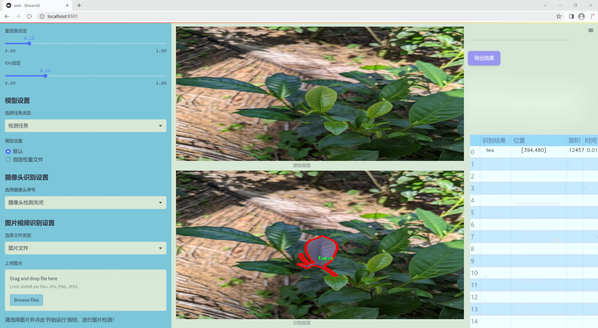
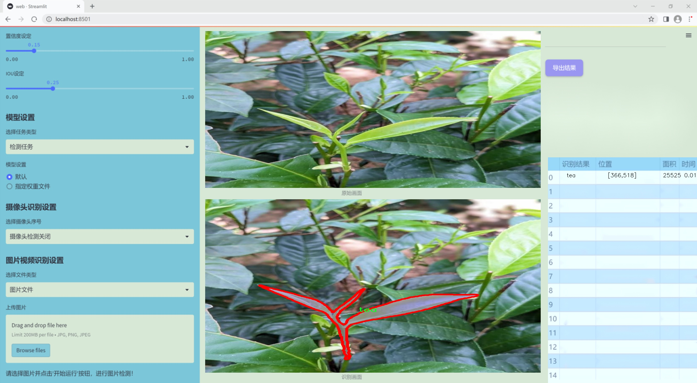
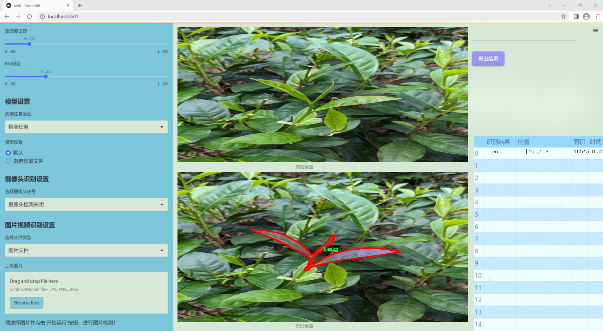
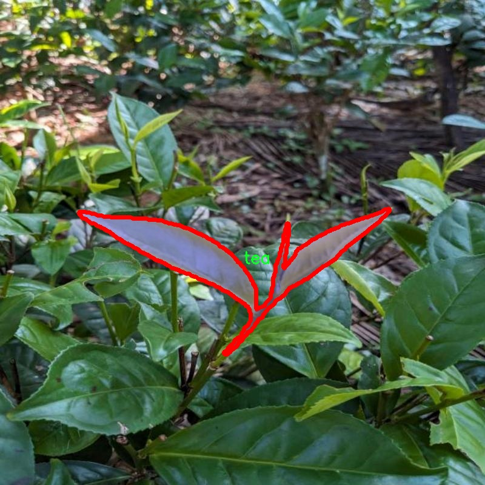
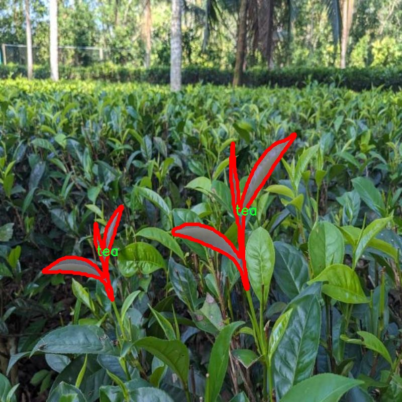
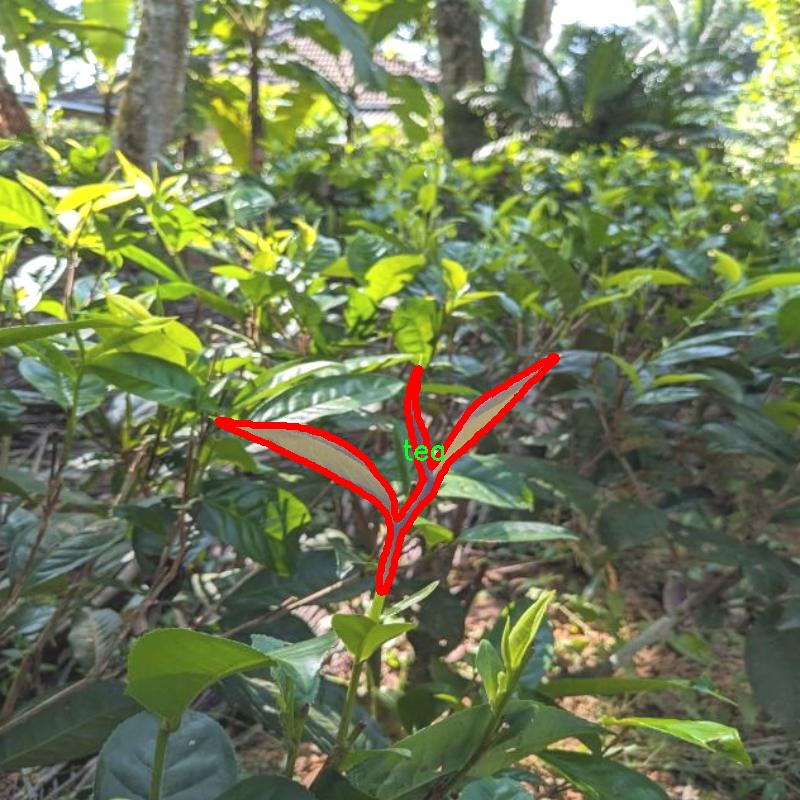
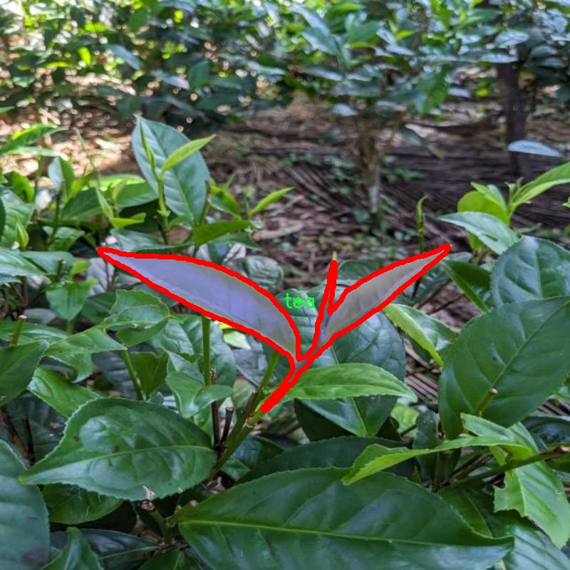

### 1.背景意义

### 研究背景与意义

茶叶作为一种重要的经济作物和文化象征，在全球范围内受到广泛的关注。随着茶叶产业的不断发展，如何提高茶叶的种植、管理和质量控制已成为行业内亟待解决的问题。传统的茶叶种植和管理方式往往依赖于人工观察和经验判断，效率低下且容易受到人为因素的影响。因此，基于计算机视觉的自动化技术在茶叶实例分割中的应用显得尤为重要。

本研究旨在开发一个基于改进YOLOv11的茶叶实例分割系统，以实现对茶叶图像的精准识别和分割。该系统将利用一个包含4900张茶叶图像的数据集，进行实例分割任务。数据集中仅包含一个类别，即“茶”，这为模型的训练和优化提供了清晰的目标。通过对茶叶图像的深度学习分析，系统能够自动识别和分割出茶叶的具体区域，从而为后续的生长监测、病虫害检测及产量预测等应用提供数据支持。

在数据预处理阶段，我们对图像进行了多种增强处理，包括随机裁剪、亮度调整和高斯模糊等，这些操作不仅丰富了训练数据的多样性，还提升了模型的鲁棒性。通过这些技术手段，我们期望能够提高模型在实际应用中的准确性和可靠性。

本研究的意义在于，通过引入先进的计算机视觉技术，推动茶叶产业的智能化发展。实例分割系统的成功实施将为茶叶的种植管理提供更为科学的依据，助力茶农提高生产效率，降低成本，同时也为茶叶的品质控制提供技术支持。最终，研究成果将为茶叶产业的可持续发展贡献力量，促进农业与科技的深度融合。

### 2.视频效果

[2.1 视频效果](https://www.bilibili.com/video/BV1YMkQYmEod/)

### 3.图片效果







##### [项目涉及的源码数据来源链接](https://kdocs.cn/l/cszuIiCKVNis)**

注意：本项目提供训练的数据集和训练教程,由于版本持续更新,暂不提供权重文件（best.pt）,请按照6.训练教程进行训练后实现上图演示的效果。

### 4.数据集信息

##### 4.1 本项目数据集类别数＆类别名

nc: 1
names: ['tea']


该项目为【图像分割】数据集，请在【训练教程和Web端加载模型教程（第三步）】这一步的时候按照【图像分割】部分的教程来训练

##### 4.2 本项目数据集信息介绍

本项目数据集信息介绍

本项目旨在通过改进YOLOv11算法，构建一个高效的茶叶实例分割系统，以实现对茶叶图像的精准识别与分割。为此，我们构建了一个专门针对茶叶的图像数据集，命名为“tea123”。该数据集专注于茶叶这一单一类别，旨在为模型的训练提供丰富而多样的样本。数据集中包含了大量的茶叶图像，这些图像在不同的环境、光照条件和角度下拍摄，确保了数据的多样性和代表性。

数据集的类别数量为1，具体类别为“tea”。这一单一类别的选择使得模型能够集中学习茶叶的特征，提升实例分割的准确性。每张图像均经过精心标注，确保每个茶叶实例都被准确框定和分割。这种高质量的标注为模型的训练提供了坚实的基础，帮助其更好地理解茶叶的形态特征及其在不同背景下的表现。

在数据集的构建过程中，我们特别关注了茶叶的不同种类、形态和生长状态，以便于模型能够识别出茶叶在不同生长阶段的变化。这种多样化的样本不仅提升了模型的泛化能力，也为实际应用提供了更为全面的支持。此外，数据集中的图像均经过标准化处理，以确保在训练过程中模型能够高效地学习到茶叶的特征。

通过“tea123”数据集的构建与应用，我们期望能够显著提升YOLOv11在茶叶实例分割任务中的表现，为茶叶的自动化检测与管理提供有力的技术支持。该数据集的使用将为相关研究提供重要的实验基础，并推动茶叶行业的智能化发展。










### 5.全套项目环境部署视频教程（零基础手把手教学）

[5.1 所需软件PyCharm和Anaconda安装教程（第一步）](https://www.bilibili.com/video/BV1BoC1YCEKi/?spm_id_from=333.999.0.0&vd_source=bc9aec86d164b67a7004b996143742dc)


[5.2 安装Python虚拟环境创建和依赖库安装视频教程（第二步）](https://www.bilibili.com/video/BV1ZoC1YCEBw?spm_id_from=333.788.videopod.sections&vd_source=bc9aec86d164b67a7004b996143742dc)

### 6.改进YOLOv11训练教程和Web_UI前端加载模型教程（零基础手把手教学）

[6.1 改进YOLOv11训练教程和Web_UI前端加载模型教程（第三步）](https://www.bilibili.com/video/BV1BoC1YCEhR?spm_id_from=333.788.videopod.sections&vd_source=bc9aec86d164b67a7004b996143742dc)


按照上面的训练视频教程链接加载项目提供的数据集，运行train.py即可开始训练



     Epoch   gpu_mem       box       obj       cls    labels  img_size
     1/200     20.8G   0.01576   0.01955  0.007536        22      1280: 100%|██████████| 849/849 [14:42<00:00,  1.04s/it]
               Class     Images     Labels          P          R     mAP@.5 mAP@.5:.95: 100%|██████████| 213/213 [01:14<00:00,  2.87it/s]
                 all       3395      17314      0.994      0.957      0.0957      0.0843

     Epoch   gpu_mem       box       obj       cls    labels  img_size
     2/200     20.8G   0.01578   0.01923  0.007006        22      1280: 100%|██████████| 849/849 [14:44<00:00,  1.04s/it]
               Class     Images     Labels          P          R     mAP@.5 mAP@.5:.95: 100%|██████████| 213/213 [01:12<00:00,  2.95it/s]
                 all       3395      17314      0.996      0.956      0.0957      0.0845

     Epoch   gpu_mem       box       obj       cls    labels  img_size
     3/200     20.8G   0.01561    0.0191  0.006895        27      1280: 100%|██████████| 849/849 [10:56<00:00,  1.29it/s]
               Class     Images     Labels          P          R     mAP@.5 mAP@.5:.95: 100%|███████   | 187/213 [00:52<00:00,  4.04it/s]
                 all       3395      17314      0.996      0.957      0.0957      0.0845


###### [项目数据集下载链接](https://kdocs.cn/l/cszuIiCKVNis)

### 7.原始YOLOv11算法讲解


##### YOLO11介绍

Ultralytics YOLO11是一款尖端的、最先进的模型，它在之前YOLO版本成功的基础上进行了构建，并引入了新功能和改进，以进一步提升性能和灵活性。
**YOLO11设计快速、准确且易于使用，使其成为各种物体检测和跟踪、实例分割、图像分类以及姿态估计任务的绝佳选择。**


**结构图如下：**


##### **C3k2**

**C3k2，结构图如下**


**C3k2，继承自类`C2f，其中通过c3k设置False或者Ture来决定选择使用C3k还是`**Bottleneck


**实现代码** **ultralytics/nn/modules/block.py**

##### C2PSA介绍

**借鉴V10 PSA结构，实现了C2PSA和C2fPSA，最终选择了基于C2的C2PSA（可能涨点更好？）**


**实现代码** **ultralytics/nn/modules/block.py**

##### Detect介绍

**分类检测头引入了DWConv（更加轻量级，为后续二次创新提供了改进点），结构图如下（和V8的区别）：**


### 8.200+种全套改进YOLOV11创新点原理讲解

#### 8.1 200+种全套改进YOLOV11创新点原理讲解大全

由于篇幅限制，每个创新点的具体原理讲解就不全部展开，具体见下列网址中的改进模块对应项目的技术原理博客网址【Blog】（创新点均为模块化搭建，原理适配YOLOv5~YOLOv11等各种版本）

[改进模块技术原理博客【Blog】网址链接](https://gitee.com/qunmasj/good)


#### 8.2 精选部分改进YOLOV11创新点原理讲解

###### 这里节选部分改进创新点展开原理讲解(完整的改进原理见上图和[改进模块技术原理博客链接](https://gitee.com/qunmasj/good)【如果此小节的图加载失败可以通过CSDN或者Github搜索该博客的标题访问原始博客，原始博客图片显示正常】
### CBAM空间注意力机制
近年来，随着深度学习研究方向的火热，注意力机制也被广泛地应用在图像识别、语音识别和自然语言处理等领域，注意力机制在深度学习任务中发挥着举足轻重的作用。注意力机制借鉴于人类的视觉系统，例如，人眼在看到一幅画面时，会倾向于关注画面中的重要信息，而忽略其他可见的信息。深度学习中的注意力机制和人类视觉的注意力机制相似，通过扫描全局数据，从大量数据中选择出需要重点关注的、对当前任务更为重要的信息，然后对这部分信息分配更多的注意力资源，从这些信息中获取更多所需要的细节信息，而抑制其他无用的信息。而在深度学习中，则具体表现为给感兴趣的区域更高的权重，经过网络的学习和调整，得到最优的权重分配，形成网络模型的注意力，使网络拥有更强的学习能力，加快网络的收敛速度。
注意力机制通常可分为软注意力机制和硬注意力机制[4-5]。软注意力机制在选择信息时，不是从输入的信息中只选择1个，而会用到所有输入信息，只是各个信息对应的权重分配不同，然后输入网络模型进行计算;硬注意力机制则是从输入的信息中随机选取一个或者选择概率最高的信息，但是这一步骤通常是不可微的，导致硬注意力机制更难训练。因此，软注意力机制应用更为广泛，按照原理可将软注意力机制划分为:通道注意力机制（channel attention)、空间注意力机制(spatial attention）和混合域注意力机制(mixed attention)。
通道注意力机制的本质建立各个特征通道之间的重要程度，对感兴趣的通道进行重点关注，弱化不感兴趣的通道的作用;空间注意力的本质则是建模了整个空间信息的重要程度，然后对空间内感兴趣的区域进行重点关注，弱化其余非感兴趣区域的作用;混合注意力同时运用了通道注意力和空间注意力，两部分先后进行或并行，形成对通道特征和空间特征同时关注的注意力模型。

卷积层注意力模块(Convolutional Block Attention Module，CBAM）是比较常用的混合注意力模块，其先后集中了通道注意力模块和空间注意力模块，网络中加入该模块能有效提高网络性能，减少网络模型的计算量，模块结构如图所示。输入特征图首先经过分支的通道注意力模块，然后和主干的原特征图融合，得到具有通道注意力的特征图，接着经过分支的空间注意力模块，在和主干的特征图融合后，得到同时具有通道特征注意力和空间特征注意力的特征图。CBAM模块不改变输入特征图的大小，因此该模块是一个“即插即用”的模块，可以插入网络的任何位置。

通道注意力模块的结构示意图如图所示，通道注意力模块分支并行地对输入的特征图进行最大池化操作和平均池化操作，然后利用多层感知机对结果进行变换，得到应用于两个通道的变换结果，最后经过sigmoid激活函数将变换结果融合，得到具有通道注意力的通道特征图。

空间注意力模块示意图如图所示，将通道注意力模块输出的特征图作为该模块的输入特征图，首先对输入特征图进行基于通道的最大池化操作和平均池化操作，将两部分得到的结果拼接起来，然后通过卷积得到降为Ⅰ通道的特征图，最后通过sigmoid激活函数生成具有空间注意力的特征图。


### 9.系统功能展示

图9.1.系统支持检测结果表格显示

  图9.2.系统支持置信度和IOU阈值手动调节

  图9.3.系统支持自定义加载权重文件best.pt(需要你通过步骤5中训练获得)

  图9.4.系统支持摄像头实时识别

  图9.5.系统支持图片识别

  图9.6.系统支持视频识别

  图9.7.系统支持识别结果文件自动保存

  图9.8.系统支持Excel导出检测结果数据


### 10. YOLOv11核心改进源码讲解

#### 10.1 convnextv2.py

以下是经过简化和注释的核心代码，保留了主要的结构和功能，同时对每个部分进行了详细的中文注释：

```python
import torch
import torch.nn as nn
import torch.nn.functional as F
from timm.models.layers import trunc_normal_, DropPath

class LayerNorm(nn.Module):
    """ 支持两种数据格式的层归一化：channels_last（默认）或 channels_first。 """
    def __init__(self, normalized_shape, eps=1e-6, data_format="channels_last"):
        super().__init__()
        self.weight = nn.Parameter(torch.ones(normalized_shape))  # 权重参数
        self.bias = nn.Parameter(torch.zeros(normalized_shape))    # 偏置参数
        self.eps = eps
        self.data_format = data_format
        if self.data_format not in ["channels_last", "channels_first"]:
            raise NotImplementedError 
        self.normalized_shape = (normalized_shape, )
    
    def forward(self, x):
        """ 前向传播，执行层归一化。 """
        if self.data_format == "channels_last":
            return F.layer_norm(x, self.normalized_shape, self.weight, self.bias, self.eps)
        elif self.data_format == "channels_first":
            u = x.mean(1, keepdim=True)  # 计算均值
            s = (x - u).pow(2).mean(1, keepdim=True)  # 计算方差
            x = (x - u) / torch.sqrt(s + self.eps)  # 标准化
            x = self.weight[:, None, None] * x + self.bias[:, None, None]  # 应用权重和偏置
            return x

class Block(nn.Module):
    """ ConvNeXtV2 块，包含深度卷积、归一化、激活和全连接层。 """
    def __init__(self, dim, drop_path=0.):
        super().__init__()
        self.dwconv = nn.Conv2d(dim, dim, kernel_size=7, padding=3, groups=dim)  # 深度卷积
        self.norm = LayerNorm(dim, eps=1e-6)  # 层归一化
        self.pwconv1 = nn.Linear(dim, 4 * dim)  # 1x1 卷积（线性层）
        self.act = nn.GELU()  # 激活函数
        self.pwconv2 = nn.Linear(4 * dim, dim)  # 1x1 卷积（线性层）
        self.drop_path = DropPath(drop_path) if drop_path > 0. else nn.Identity()  # 随机深度

    def forward(self, x):
        """ 前向传播，执行一系列操作。 """
        input = x
        x = self.dwconv(x)  # 深度卷积
        x = self.norm(x.permute(0, 2, 3, 1))  # 归一化
        x = self.pwconv1(x)  # 1x1 卷积
        x = self.act(x)  # 激活
        x = self.pwconv2(x)  # 1x1 卷积
        x = x.permute(0, 3, 1, 2)  # 变换维度
        x = input + self.drop_path(x)  # 残差连接
        return x

class ConvNeXtV2(nn.Module):
    """ ConvNeXt V2 模型。 """
    def __init__(self, in_chans=3, num_classes=1000, depths=[3, 3, 9, 3], dims=[96, 192, 384, 768], drop_path_rate=0.):
        super().__init__()
        self.downsample_layers = nn.ModuleList()  # 下采样层
        stem = nn.Sequential(
            nn.Conv2d(in_chans, dims[0], kernel_size=4, stride=4),  # 初始卷积层
            LayerNorm(dims[0], eps=1e-6, data_format="channels_first")  # 归一化
        )
        self.downsample_layers.append(stem)
        for i in range(3):
            downsample_layer = nn.Sequential(
                LayerNorm(dims[i], eps=1e-6, data_format="channels_first"),
                nn.Conv2d(dims[i], dims[i+1], kernel_size=2, stride=2),  # 下采样卷积层
            )
            self.downsample_layers.append(downsample_layer)

        self.stages = nn.ModuleList()  # 特征分辨率阶段
        dp_rates = [x.item() for x in torch.linspace(0, drop_path_rate, sum(depths))] 
        cur = 0
        for i in range(4):
            stage = nn.Sequential(
                *[Block(dim=dims[i], drop_path=dp_rates[cur + j]) for j in range(depths[i])]  # 添加多个块
            )
            self.stages.append(stage)
            cur += depths[i]

        self.norm = nn.LayerNorm(dims[-1], eps=1e-6)  # 最终归一化层
        self.head = nn.Linear(dims[-1], num_classes)  # 分类头

    def forward(self, x):
        """ 前向传播，经过下采样和特征提取阶段。 """
        for i in range(4):
            x = self.downsample_layers[i](x)  # 下采样
            x = self.stages[i](x)  # 特征提取
        return x  # 返回最后的特征图

# 模型构建函数
def convnextv2(weights='', **kwargs):
    model = ConvNeXtV2(**kwargs)  # 创建模型
    if weights:
        model.load_state_dict(torch.load(weights)['model'])  # 加载权重
    return model
```

### 主要改动和注释说明：
1. **LayerNorm**：实现了层归一化，支持两种数据格式，提供了详细的注释以解释每个步骤。
2. **Block**：定义了ConvNeXtV2的基本构建块，包含深度卷积、归一化、激活和残差连接。
3. **ConvNeXtV2**：定义了整个模型结构，包括下采样层和多个特征提取阶段。
4. **forward方法**：在每个类中提供了前向传播的详细步骤。
5. **模型构建函数**：提供了创建模型的接口，并可选择性地加载预训练权重。

通过这些改动，代码的结构更加清晰，功能更加突出，同时注释帮助理解每个部分的作用。

这个文件定义了一个名为 ConvNeXt V2 的深度学习模型，主要用于图像分类任务。代码中使用了 PyTorch 框架，并且包含了一些自定义的层和模块。首先，文件中引入了必要的库，包括 PyTorch 的核心模块和一些功能模块。接下来，定义了一些基础组件，如 LayerNorm 和 GRN，这些组件在模型的构建中起到了重要的作用。

LayerNorm 类实现了层归一化，支持两种数据格式：通道优先和通道后置。它通过可学习的权重和偏置对输入进行归一化处理，确保模型在训练过程中能够更好地收敛。GRN 类则实现了全局响应归一化，它通过计算输入的 L2 范数并进行归一化处理，增强了模型对特征的响应能力。

Block 类是 ConvNeXt V2 的基本构建块，包含了深度可分离卷积、归一化、激活函数和全连接层等。它通过跳跃连接将输入与输出相加，形成残差结构，促进了信息的流动和梯度的传播。ConvNeXtV2 类则是整个模型的核心部分，它由多个 Block 组成，并通过下采样层逐步减小特征图的尺寸，同时增加特征的维度。

在 ConvNeXtV2 的初始化中，定义了输入通道数、分类头的类别数、每个阶段的块数和特征维度等参数。模型的构建包括一个初始的卷积层和多个下采样层，后面是多个特征分辨率阶段，每个阶段由多个 Block 组成。最后，模型还包含一个归一化层和一个线性分类头。

文件中还定义了一些函数，用于创建不同规模的 ConvNeXt V2 模型（如 atto、femto、pico 等），这些函数可以加载预训练的权重，方便用户使用。update_weight 函数用于更新模型的权重，确保加载的权重与模型的结构相匹配。

总的来说，这个文件实现了一个灵活且高效的卷积神经网络结构，适用于各种图像分类任务，并提供了多种模型变体以满足不同的需求。

#### 10.2 mobilenetv4.py

以下是代码中最核心的部分，并附上详细的中文注释：

```python
import torch
import torch.nn as nn

# 定义 MobileNetV4 的模型规格
MODEL_SPECS = {
    "MobileNetV4ConvSmall": MNV4ConvSmall_BLOCK_SPECS,
    "MobileNetV4ConvMedium": MNV4ConvMedium_BLOCK_SPECS,
    "MobileNetV4ConvLarge": MNV4ConvLarge_BLOCK_SPECS,
    "MobileNetV4HybridMedium": MNV4HybridConvMedium_BLOCK_SPECS,
    "MobileNetV4HybridLarge": MNV4HybridConvLarge_BLOCK_SPECS,
}

def conv_2d(inp, oup, kernel_size=3, stride=1, groups=1, bias=False, norm=True, act=True):
    """
    创建一个 2D 卷积层，包含卷积、批归一化和激活函数。
    
    Args:
        inp: 输入通道数
        oup: 输出通道数
        kernel_size: 卷积核大小
        stride: 步幅
        groups: 分组卷积的组数
        bias: 是否使用偏置
        norm: 是否使用批归一化
        act: 是否使用激活函数
    
    Returns:
        包含卷积、批归一化和激活函数的序列模块
    """
    conv = nn.Sequential()
    padding = (kernel_size - 1) // 2  # 计算填充
    conv.add_module('conv', nn.Conv2d(inp, oup, kernel_size, stride, padding, bias=bias, groups=groups))
    if norm:
        conv.add_module('BatchNorm2d', nn.BatchNorm2d(oup))  # 添加批归一化
    if act:
        conv.add_module('Activation', nn.ReLU6())  # 添加激活函数
    return conv

class InvertedResidual(nn.Module):
    """
    反向残差块，包含扩展卷积、深度卷积和投影卷积。
    """
    def __init__(self, inp, oup, stride, expand_ratio, act=False):
        super(InvertedResidual, self).__init__()
        self.stride = stride
        assert stride in [1, 2]  # 步幅只能是1或2
        hidden_dim = int(round(inp * expand_ratio))  # 计算隐藏层维度
        self.block = nn.Sequential()
        if expand_ratio != 1:
            self.block.add_module('exp_1x1', conv_2d(inp, hidden_dim, kernel_size=1, stride=1))  # 扩展卷积
        self.block.add_module('conv_3x3', conv_2d(hidden_dim, hidden_dim, kernel_size=3, stride=stride, groups=hidden_dim))  # 深度卷积
        self.block.add_module('red_1x1', conv_2d(hidden_dim, oup, kernel_size=1, stride=1, act=act))  # 投影卷积
        self.use_res_connect = self.stride == 1 and inp == oup  # 判断是否使用残差连接

    def forward(self, x):
        if self.use_res_connect:
            return x + self.block(x)  # 使用残差连接
        else:
            return self.block(x)

class MobileNetV4(nn.Module):
    """
    MobileNetV4 模型类，包含多个卷积层和反向残差块。
    """
    def __init__(self, model):
        super().__init__()
        assert model in MODEL_SPECS.keys()  # 确保模型名称有效
        self.model = model
        self.spec = MODEL_SPECS[self.model]
       
        # 根据模型规格构建各层
        self.conv0 = build_blocks(self.spec['conv0'])
        self.layer1 = build_blocks(self.spec['layer1'])
        self.layer2 = build_blocks(self.spec['layer2'])
        self.layer3 = build_blocks(self.spec['layer3'])
        self.layer4 = build_blocks(self.spec['layer4'])
        self.layer5 = build_blocks(self.spec['layer5'])
        self.features = nn.ModuleList([self.conv0, self.layer1, self.layer2, self.layer3, self.layer4, self.layer5])     

    def forward(self, x):
        features = [None, None, None, None]  # 用于存储特征图
        for f in self.features:
            x = f(x)  # 通过每一层
            # 根据输入大小记录特征图
            if x.size(2) in [x.size(2) // 4, x.size(2) // 8, x.size(2) // 16, x.size(2) // 32]:
                features[x.size(2) // 4] = x
        return features

# 创建 MobileNetV4ConvSmall 模型的函数
def MobileNetV4ConvSmall():
    model = MobileNetV4('MobileNetV4ConvSmall')
    return model

if __name__ == '__main__':
    model = MobileNetV4ConvSmall()  # 实例化模型
    inputs = torch.randn((1, 3, 640, 640))  # 创建输入张量
    res = model(inputs)  # 前向传播
    for i in res:
        print(i.size())  # 打印输出特征图的尺寸
```

### 代码说明：
1. **conv_2d 函数**：创建一个包含卷积、批归一化和激活函数的序列模块。
2. **InvertedResidual 类**：实现反向残差块，包含扩展卷积、深度卷积和投影卷积。
3. **MobileNetV4 类**：构建 MobileNetV4 模型，初始化各层并定义前向传播过程。
4. **MobileNetV4ConvSmall 函数**：用于实例化 MobileNetV4ConvSmall 模型。
5. **主程序**：创建模型实例并进行前向传播，打印输出特征图的尺寸。

这个程序文件定义了一个名为 `MobileNetV4` 的深度学习模型，主要用于图像分类任务。它使用了 PyTorch 框架，包含了多种不同配置的 MobileNetV4 变体，包括小型、中型和大型模型，以及混合型模型。文件中首先导入了一些必要的库和模块，并定义了一些模型的结构参数。

在文件中，`MNV4ConvSmall_BLOCK_SPECS`、`MNV4ConvMedium_BLOCK_SPECS` 和 `MNV4ConvLarge_BLOCK_SPECS` 等字典分别定义了不同模型的层结构和参数。这些字典中包含了每一层的名称、块的数量以及具体的块规格，如输入输出通道数、卷积核大小、步幅等。

`make_divisible` 函数用于确保所有层的通道数都是 8 的倍数，以满足模型的设计要求。`conv_2d` 函数则是一个辅助函数，用于构建带有卷积、批归一化和激活函数的序列模块。

`InvertedResidual` 类实现了倒残差块，这是一种在 MobileNet 结构中常用的模块，能够有效地减少计算量并保持模型的性能。`UniversalInvertedBottleneckBlock` 类实现了通用的倒瓶颈块，支持不同的卷积核大小和扩展比。

`build_blocks` 函数根据传入的层规格构建相应的层，支持多种类型的块，包括常规卷积块、倒残差块和通用倒瓶颈块。

`MobileNetV4` 类是模型的主类，它根据指定的模型类型（如小型、中型、大型等）构建相应的网络结构。模型的前向传播方法 `forward` 会返回不同尺度的特征图，适用于后续的处理。

最后，文件中定义了一些函数用于创建不同类型的 MobileNetV4 模型，并在主程序中提供了一个示例，展示了如何实例化一个小型模型并进行一次前向传播，输出特征图的尺寸。

整体而言，这个文件实现了 MobileNetV4 的多种变体，适用于不同的应用场景，并提供了灵活的结构配置选项。

#### 10.3 prepbn.py

以下是代码中最核心的部分，并附上详细的中文注释：

```python
import torch
import torch.nn as nn

# 定义一个自定义的批量归一化层，带有可学习的参数
class RepBN(nn.Module):
    def __init__(self, channels):
        super(RepBN, self).__init__()
        # 初始化一个可学习的参数 alpha，初始值为 1
        self.alpha = nn.Parameter(torch.ones(1))
        # 初始化一个一维批量归一化层
        self.bn = nn.BatchNorm1d(channels)

    def forward(self, x):
        # 将输入张量的维度进行转置，以适应 BatchNorm1d 的输入格式
        x = x.transpose(1, 2)
        # 进行批量归一化，并加上 alpha * x
        x = self.bn(x) + self.alpha * x
        # 再次转置回原来的维度
        x = x.transpose(1, 2)
        return x

# 定义一个线性归一化层，结合了两个不同的归一化方法
class LinearNorm(nn.Module):
    def __init__(self, dim, norm1, norm2, warm=0, step=300000, r0=1.0):
        super(LinearNorm, self).__init__()
        # 注册一些缓冲区，用于存储暖启动次数和迭代次数
        self.register_buffer('warm', torch.tensor(warm))
        self.register_buffer('iter', torch.tensor(step))
        self.register_buffer('total_step', torch.tensor(step))
        self.r0 = r0  # 初始比例因子
        # 初始化两个归一化方法
        self.norm1 = norm1(dim)
        self.norm2 = norm2(dim)

    def forward(self, x):
        # 如果模型处于训练状态
        if self.training:
            # 如果还有暖启动次数
            if self.warm > 0:
                # 减少暖启动次数
                self.warm.copy_(self.warm - 1)
                # 使用第一个归一化方法
                x = self.norm1(x)
            else:
                # 计算当前的比例因子 lamda
                lamda = self.r0 * self.iter / self.total_step
                # 如果还有迭代次数，减少迭代次数
                if self.iter > 0:
                    self.iter.copy_(self.iter - 1)
                # 使用两个归一化方法
                x1 = self.norm1(x)
                x2 = self.norm2(x)
                # 按照 lamda 的比例组合两个归一化的结果
                x = lamda * x1 + (1 - lamda) * x2
        else:
            # 如果模型不在训练状态，直接使用第二个归一化方法
            x = self.norm2(x)
        return x
```

### 代码核心部分说明：
1. **RepBN 类**：自定义的批量归一化层，增加了一个可学习的参数 `alpha`，用于调整归一化的输出。
2. **LinearNorm 类**：结合了两种归一化方法的线性归一化层，支持暖启动和动态调整归一化策略。通过 `lamda` 控制两个归一化方法的比例，以便在训练过程中逐步过渡到第二种归一化方法。

这个程序文件定义了两个神经网络模块，分别是 `RepBN` 和 `LinearNorm`，它们都是基于 PyTorch 框架构建的。

首先，`RepBN` 类是一个自定义的批量归一化模块。它的构造函数 `__init__` 接受一个参数 `channels`，用于指定输入数据的通道数。在构造函数中，首先调用父类的构造函数，然后定义了一个可学习的参数 `alpha`，并初始化为 1。接着，创建了一个标准的 1D 批量归一化层 `bn`。在 `forward` 方法中，输入 `x` 的维度被转置，以便与批量归一化层的输入要求相匹配。经过批量归一化处理后，输出结果与 `alpha` 乘以原始输入 `x` 相加，最后再将结果转置回原来的维度并返回。

接下来是 `LinearNorm` 类，它实现了一种线性归一化的策略。构造函数接受多个参数，包括 `dim`（维度）、`norm1` 和 `norm2`（分别是两个归一化方法）、`warm`（预热步数）、`step`（迭代步数）和 `r0`（初始比例因子）。在构造函数中，使用 `register_buffer` 方法注册了一些持久化的张量，这些张量在模型训练过程中会保持其状态。`norm1` 和 `norm2` 是传入的归一化方法，分别用于不同的训练阶段。

在 `forward` 方法中，首先检查模型是否处于训练模式。如果是，并且 `warm` 大于 0，则执行 `norm1` 归一化，并将 `warm` 减 1。否则，计算一个动态的比例因子 `lamda`，它是根据当前的迭代次数和总步数计算得出的。如果 `iter` 大于 0，则将其减 1。接着，分别对输入 `x` 应用 `norm1` 和 `norm2` 归一化，最后根据计算出的 `lamda` 将两者加权结合，形成最终的输出。如果模型不在训练模式下，则直接使用 `norm2` 对输入 `x` 进行归一化处理并返回。

总体来说，这个文件实现了两个自定义的神经网络模块，分别用于批量归一化和线性归一化，提供了灵活的归一化策略以适应不同的训练阶段。

#### 10.4 kaln_conv.py

以下是代码中最核心的部分，并附上详细的中文注释：

```python
from functools import lru_cache
import torch
import torch.nn as nn
from torch.nn.functional import conv3d, conv2d, conv1d

class KALNConvNDLayer(nn.Module):
    def __init__(self, conv_class, norm_class, conv_w_fun, input_dim, output_dim, degree, kernel_size,
                 groups=1, padding=0, stride=1, dilation=1, dropout: float = 0.0, ndim: int = 2):
        super(KALNConvNDLayer, self).__init__()
        
        # 初始化参数
        self.inputdim = input_dim  # 输入维度
        self.outdim = output_dim    # 输出维度
        self.degree = degree         # 多项式的阶数
        self.kernel_size = kernel_size  # 卷积核大小
        self.padding = padding       # 填充
        self.stride = stride         # 步幅
        self.dilation = dilation     # 膨胀
        self.groups = groups         # 分组卷积的组数
        self.base_activation = nn.SiLU()  # 基础激活函数
        self.conv_w_fun = conv_w_fun  # 卷积权重函数
        self.ndim = ndim             # 数据的维度（1D, 2D, 3D）
        self.dropout = None          # Dropout层初始化为None

        # 根据dropout的值初始化Dropout层
        if dropout > 0:
            if ndim == 1:
                self.dropout = nn.Dropout1d(p=dropout)
            elif ndim == 2:
                self.dropout = nn.Dropout2d(p=dropout)
            elif ndim == 3:
                self.dropout = nn.Dropout3d(p=dropout)

        # 检查分组参数的有效性
        if groups <= 0:
            raise ValueError('groups must be a positive integer')
        if input_dim % groups != 0:
            raise ValueError('input_dim must be divisible by groups')
        if output_dim % groups != 0:
            raise ValueError('output_dim must be divisible by groups')

        # 创建基础卷积层和归一化层
        self.base_conv = nn.ModuleList([conv_class(input_dim // groups,
                                                   output_dim // groups,
                                                   kernel_size,
                                                   stride,
                                                   padding,
                                                   dilation,
                                                   groups=1,
                                                   bias=False) for _ in range(groups)])

        self.layer_norm = nn.ModuleList([norm_class(output_dim // groups) for _ in range(groups)])

        # 初始化多项式权重
        poly_shape = (groups, output_dim // groups, (input_dim // groups) * (degree + 1)) + tuple(
            kernel_size for _ in range(ndim))
        self.poly_weights = nn.Parameter(torch.randn(*poly_shape))

        # 使用Kaiming均匀分布初始化卷积层和多项式权重
        for conv_layer in self.base_conv:
            nn.init.kaiming_uniform_(conv_layer.weight, nonlinearity='linear')
        nn.init.kaiming_uniform_(self.poly_weights, nonlinearity='linear')

    @lru_cache(maxsize=128)  # 使用LRU缓存来避免重复计算Legendre多项式
    def compute_legendre_polynomials(self, x, order):
        # 计算Legendre多项式
        P0 = x.new_ones(x.shape)  # P0 = 1
        if order == 0:
            return P0.unsqueeze(-1)
        P1 = x  # P1 = x
        legendre_polys = [P0, P1]

        # 使用递推公式计算高阶多项式
        for n in range(1, order):
            Pn = ((2.0 * n + 1.0) * x * legendre_polys[-1] - n * legendre_polys[-2]) / (n + 1.0)
            legendre_polys.append(Pn)

        return torch.concatenate(legendre_polys, dim=1)

    def forward_kal(self, x, group_index):
        # 前向传播函数，处理每个组的输入
        base_output = self.base_conv[group_index](x)  # 基础卷积输出

        # 将输入x归一化到[-1, 1]范围
        x_normalized = 2 * (x - x.min()) / (x.max() - x.min()) - 1 if x.shape[0] > 0 else x

        # 应用Dropout
        if self.dropout is not None:
            x_normalized = self.dropout(x_normalized)

        # 计算归一化后的Legendre多项式
        legendre_basis = self.compute_legendre_polynomials(x_normalized, self.degree)

        # 使用多项式权重进行卷积操作
        poly_output = self.conv_w_fun(legendre_basis, self.poly_weights[group_index],
                                      stride=self.stride, dilation=self.dilation,
                                      padding=self.padding, groups=1)

        # 合并基础输出和多项式输出
        x = base_output + poly_output
        if isinstance(self.layer_norm[group_index], nn.LayerNorm):
            orig_shape = x.shape
            x = self.layer_norm[group_index](x.view(orig_shape[0], -1)).view(orig_shape)
        else:
            x = self.layer_norm[group_index](x)
        x = self.base_activation(x)  # 应用激活函数

        return x

    def forward(self, x):
        # 前向传播函数，处理所有组的输入
        split_x = torch.split(x, self.inputdim // self.groups, dim=1)  # 按组分割输入
        output = []
        for group_ind, _x in enumerate(split_x):
            y = self.forward_kal(_x.clone(), group_ind)  # 对每个组调用forward_kal
            output.append(y.clone())
        y = torch.cat(output, dim=1)  # 合并所有组的输出
        return y
```

### 代码核心部分说明：
1. **KALNConvNDLayer类**：这是一个自定义的卷积层，支持多维卷积（1D、2D、3D），并结合了Legendre多项式的计算。
2. **初始化方法**：设置卷积层、归一化层和多项式权重，并进行参数的有效性检查。
3. **计算Legendre多项式**：使用递推公式计算多项式，并利用LRU缓存提高效率。
4. **前向传播方法**：分别处理每个组的输入，计算基础卷积输出和多项式输出，并结合激活函数进行最终输出。

这个程序文件 `kaln_conv.py` 定义了一组用于卷积神经网络的层，主要包括多维卷积层（1D、2D、3D），这些层实现了基于勒让德多项式的卷积操作。代码中使用了 PyTorch 框架，主要包括以下几个部分。

首先，定义了一个基类 `KALNConvNDLayer`，它继承自 `nn.Module`。在构造函数中，初始化了一些参数，包括输入和输出维度、卷积核大小、分组数、步幅、填充、扩张率等。这个类还定义了一个激活函数（SiLU）和一个可选的 dropout 层。接着，检查了分组数和输入输出维度的有效性。

在 `KALNConvNDLayer` 中，创建了多个卷积层和归一化层，这些层是通过 `nn.ModuleList` 进行管理的。卷积层的数量与分组数相同，每个卷积层的输入和输出通道数是根据分组数进行划分的。此外，还定义了一个多项式权重参数，用于存储与勒让德多项式相关的权重。

`compute_legendre_polynomials` 方法用于计算勒让德多项式，使用了递归关系来生成高阶多项式，并通过 `lru_cache` 装饰器进行缓存，以提高计算效率。

`forward_kal` 方法实现了前向传播的具体逻辑。它首先对输入进行卷积操作，然后对输入进行归一化，计算勒让德多项式，并通过多项式权重进行线性变换。最后，将卷积输出和多项式输出相加，经过归一化和激活函数处理后返回。

`forward` 方法是整个层的前向传播入口，它将输入数据按分组拆分，并对每个分组调用 `forward_kal` 方法，最后将所有分组的输出拼接在一起。

接下来，定义了三个子类 `KALNConv3DLayer`、`KALNConv2DLayer` 和 `KALNConv1DLayer`，分别对应三维、二维和一维卷积层。这些子类通过调用基类的构造函数来初始化卷积层和归一化层，传入相应的卷积类和归一化类。

整体来看，这个文件实现了一种新的卷积层，结合了勒让德多项式的特性，旨在提升神经网络的表达能力和性能。

### 11.完整训练+Web前端界面+200+种全套创新点源码、数据集获取


# [下载链接：https://mbd.pub/o/bread/Z52Tkppv](https://mbd.pub/o/bread/Z52Tkppv)